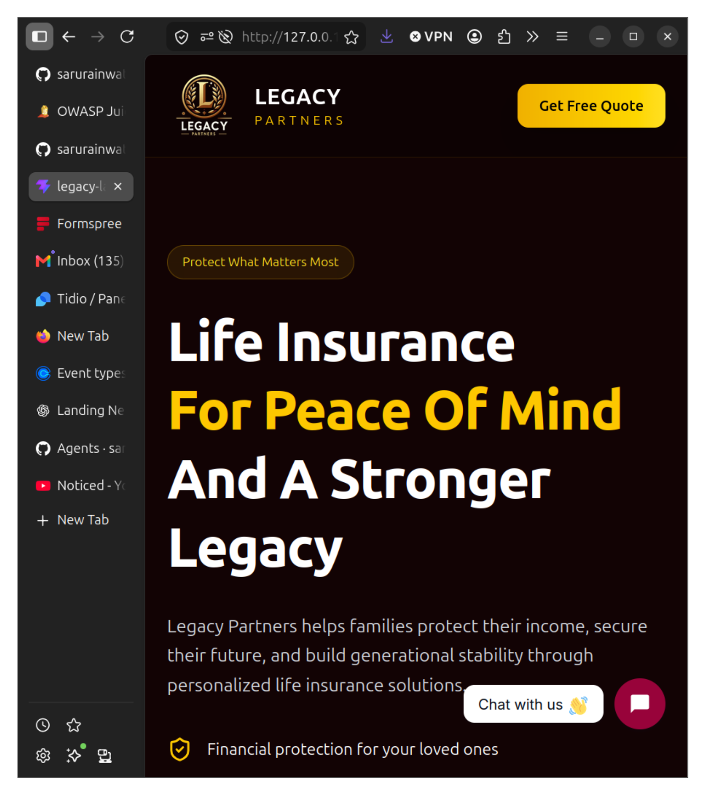
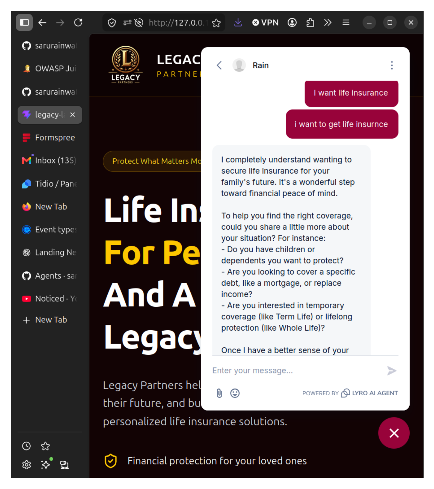
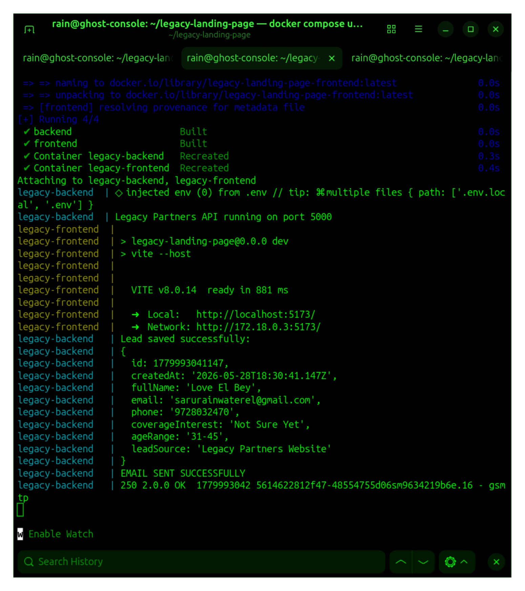

# Legacy Partners Lead Platform

A containerized full-stack lead generation platform built for Legacy Partners.

## Overview

This platform was designed to automate and streamline insurance lead generation through a modern cloud-ready architecture.

The system combines:
- React frontend
- Node.js/Express backend
- Docker containerization
- AI chatbot integration
- automated lead capture
- email notifications
- Calendly consultation scheduling

# Screenshots

## Homepage



## AI Chatbot



## Docker Containers



---

# Features

## Frontend
- React + Vite
- Tailwind CSS UI
- responsive design
- branded landing page
- integrated consultation flow

## Backend
- Node.js
- Express REST API
- JSON lead persistence
- automated email notifications
- API-driven architecture

## Automation
- Tidio AI chatbot
- lead qualification flow
- Calendly scheduling integration
- automated customer intake

## DevOps / Infrastructure
- Docker containerization
- multi-service architecture
- frontend/backend separation
- cloud deployment ready

---

# Tech Stack

- React
- Vite
- Tailwind CSS
- Node.js
- Express
- Docker
- Nodemailer
- Tidio
- Calendly

---

# Architecture

Browser  
↓  
React Frontend  
↓  
Express API Backend  
↓  
Lead Storage + Email Notifications  
↓  
Consultation Scheduling  

---

# Local Development

## Frontend

```bash
npm install
npm run dev

## Backend

cd backend
npm install
node server.js

#Docker Deployment

docker compose up --build

## Verify Containers

docker ps

## Environment Variables

backend/.env

EMAIL_USER=your_email@gmail.com
EMAIL_PASS=your_app_password
NOTIFY_EMAIL=your_email@gmail.com

##Deployment Architecture

Local Development (Ghost Console)
            ↓
         GitHub
            ↓
         Render
            ↓
  legacypartners.agency

##Skills Demonstrated

Frontend Development
React component architecture
Responsive design implementation
Tailwind CSS integration
Asset management and branding
DevOps & Deployment
Docker containerization
Git version control
CI/CD workflow using GitHub and Render
Custom domain configuration
SSL certificate deployment
Production troubleshooting
Cloud Engineering
Linux-based development environment
DNS management
Web hosting infrastructure
Deployment automation

##Challenges Solved
Docker container configuration
Vite production deployment
Host authorization issues
Render deployment troubleshooting

##Future Roadmap

PostgreSQL integration
OCI cloud deployment
HTTPS/SSL
Admin dashboard
CRM integration
SMS automation
Analytics dashboard
CI/CD pipeline
Kubernetes orchestration

##Website

https://legacypartners.agency

##Author

Built by C. Titus-El
Legacy Technologies
